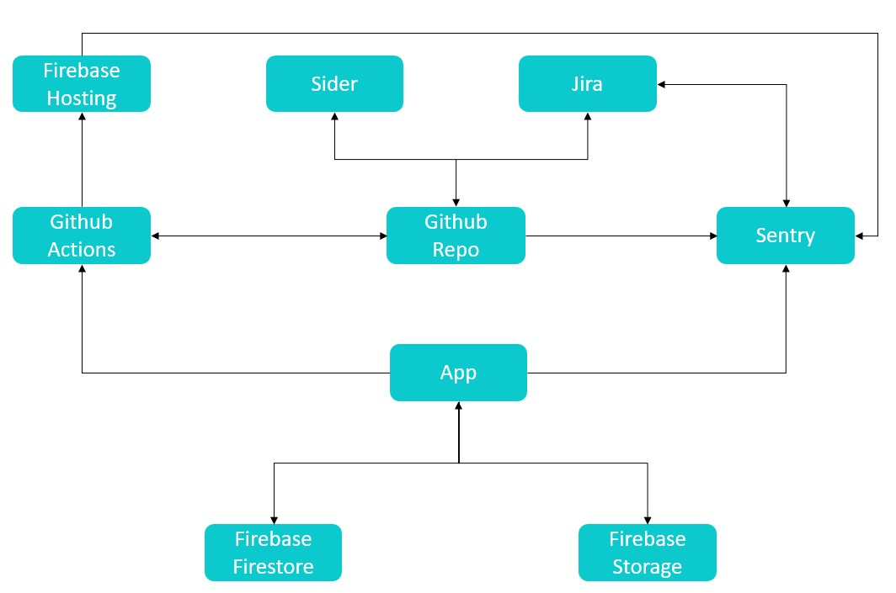

# Linked Up - Alison Vandromme

Ynov M1 Majeure - Coordination Front/Back

# Table of contents

1. [Introduction](#introduction)
2. [Stack](#stack)
3. [Development tools](#development)
   1. [Useful Resources](#useful-resources)
   2. [Docker](#docker)
   3. [Build Report](#build-report)
   4. [Documentation](#documentation)
   5. [Tests](#tests)
   5. [Tests Records](#record)
   6. [Coverage](#coverage)
   7. [Linter](#linter)
   8. [Production Preview](#production-preview)
   9. [Lighthouse](#lighthouse)
4. [Automation](#automation)
   1. [Jira](#jira)
   2. [Github Actions](#github-actions)
   3. [Sentry](#sentry)
   4. [Sider](#sider)
   5. [Better Uptime](#better-uptime)
5. [API Used](#api-used)
6. [Performance](#performance)
   1. [Sentry](#perf-sentry)
   2. [FOIT](#foit)
   3. [PWA](#pwa)
   4. [Firebase Performance](#firebase-perf)
   5. [Cloud Logging](#cloud-logging)
7. [Deployment](#deployment)

## Introduction <a name="introduction"></a>

This project was made for Bordeaux Ynov M1 Major Class - Front/Back Coordination.
This course is organized around two main axes :

- Coordination/Methodology
- Technical: Versioning, CI/CD, Testing, Multi-stage deployment, Code quality metrics generation, Documentation,...

What I've implemented:

- Jira project management
- Development environment with Docker
- Code review with Sider
- Automatic documentation generation with jsDocs
- Unit tests with Jest with coverage reports
- Build reports with webpack
- E2E tests with Cypress
- Cypress coverage generation with Istanbul
- Cypress runs records (uploaded to Cypress Dashboard)
- Global html page for development purposes, with links to all the reports and documentation
- Lighthouse reports
- CI/CD pipeline with Github Actions
- Preview URL generation with firebase
- Sentry monitoring
- Google Cloud Logging
- Better Uptime monitoring
- Status page : <a href="https://alison-vandromme.betteruptime.com"> Here </a>
- Google Analytics

## Stack <a name="stack"></a>

          

## Development tools <a name="development"></a>

### Useful resources <a name="useful-resources"></a>

dev.html can be found in the root directory.
This file links to : 
- Documentation
- Jest coverage
- Cypress coverage
- Jest & Cypress merged coverage
- Build reports
- Lighthouse reports

### Docker <a name="docker"></a>

- Uncomment the devServer config in vue.config.js
- Create a .env.local with environment variables
- Run:

```sh
docker-compose --env-file .env.local up --build

# Or
npm run docker
```

### Build report <a name="build-report"></a>

To regenerate the build report, run:

```sh
npm run build-report
```

### Documentation <a name="documentation"></a>

Documentation is generated from jsDocs annotations.
To see the documentation, open docs/index.html.

To generate or update docs, run :

```sh
npm run docs
```

### Tests <a name="tests"></a>

Unit tests are made with Jest.
Snapshot tests are also made with Jest. Each test suite starts with a snapshot test.
E2E tests are made with Cypress.

To avoid requireContext errors with Jest, we can install the plugin and add this snippet to babel.config.js :

```js
module.exports = {
  env: {
    test: {
      plugins: ['transform-require-context'],
    },
  },
};
```

### Tests records <a name="record"></a>

Cypress tests can be recorded and uploaded to Cypress Dashboard. 
To run tests (headless) with recording, run:

```sh
npx cypress run --record --key <CY_DASHBOARD_KEY>
```

Note: cypress.json must be updated with the following config :

```json
{
  "baseUrl": "http://localhost:8080/",
  "projectId": "<CY_PROJECT_ID>",
}
```

### Code coverage <a name="coverage"></a>

- Jest : Tests coverage can be found in tests/coverage/jest
- Cypress: Tests coverage can be found in tests/coverage/cypress
- Merge report can be found in tests/coverage/reports

For Jest to be able to collect coverage, we must pass the --collectCoverage flag.

```json
  "jest": {
    "preset": "@vue/cli-plugin-unit-jest",
    "transform": {
      "^.+\\.vue$": "vue-jest"
    },
    "collectCoverage": true,
    "collectCoverageFrom": [
      "src/**/*.{js,vue}"
    ],
    "coverageDirectory": "./jest-cover/",
    "coveragePathIgnorePatterns": [
      "/node_modules/",
      "/lib/",
      "/test/",
      "/utils/",
      "main.js"
    ]
  },
```

For Cypress to be able to collect coverage, Istanbul must be installed. We also need [@cypress/code-coverage](https://docs.cypress.io/guides/tooling/code-coverage).

As Jest runs on the test environment, one workaround to avoid Jest and Cypress interaction is the following config in babel.config.js

```js
const plugins = [];
if (process.env.NODE_ENV === 'e2e') {
  plugins.push([
    'babel-plugin-istanbul',
    {
      extension: ['.js', '.vue'],
      all: true,
      include: ['src'],
    },
  ]);
}
```

As windows doesn't take NODE_ENV into account, we can install [cross-env](https://www.npmjs.com/package/cross-env).

To run cypress with coverage (using Instanbul), run :

```sh
npm run cover

# The full command :
cross-env NODE_ENV=e2e nyc --silent npm run test:e2e
```

To generate the global coverage report, run:

```sh
npm run cover:merge
```


### Linter <a name="linter"></a>

Eslint is used to lint the code.
The eslint:recommended preset from vue-cli is applied.

To run the linter:

```sh
npm run lint
```

### Local production preview <a href="production-preview"></a>

The dist directory being meant to be served by an HTTP server, opening dist/index.html in a browser will not work.
A workaround is to use a Node static file server, as [serve](https://www.npmjs.com/package/serve) does.

```sh
# Install serve
npm install -g serve

# Serve the dist directory
serve -s dist
```

### Lighthouse Reports<a name="lighthouse"></a>

Lighthouse reports are located in ./lighthouse folder.

```sh
# To install lighthouse CLI
npm i -g lighthouse

# Build app and launch server
npm run preview

# Run audit
npm run lh:audit
```

The --view flag can be used to automatically open the report in a browser.

## Automation <a name="automation"></a>

<!-- ### Schema <a name="schema"></a>

 -->

### Jira <a name="jira"></a>

Each feature/fix branch has Jira's ticket issue as a reference.
As such, Jira can automatically update issue's status depending on push/PRs.

### Github Actions <a name="github-actions"></a>

- Open PR for every feature/_ or fix/_ branch
- Build, test and deploy to preview url on PR
- Open PR on merge from staging to prod
- Build, test and deploy to live url on master merge

### Sentry <a name="sentry"></a>

Sentry is integrated in the app as well as in Github repo and Jira.
A bidirectionnal flow is set between Sentry's issues and Jira's.

### Sider <a name="sider"></a>

Automated Code Review on each PR.
For now, test mode is enable so it doesn't block any PRs.

### Better Uptime <a name="better-uptime"></a>

Status page can be found <a href="https://alison-vandromme.betteruptime.com"> here </a>
Better Uptime is configured to :

- Call
- Send an SMS
- Send an email

On incident. An incident form is also automatically generated.

## APIs used <a name="api-used"></a>

- Reverse Geocode (MapQuest)
- Geo API Gouv

## Performance <a name="performance"></a>

### Sentry <a name="perf-sentry"></a>
Sentry is implemented for monitoring and includes performance data.
A build report can also be viewed in dist/report.html.
To generate a new report, run :

```sh
npm run build-report
```

If you have Vue CLI globally installed, the data is also available with

```sh
vue ui
```

### FOIT <a name="foit"></a>

To fix "Ensure text remains visible during webfont load": 
- Google fonts are loaded through the link tag in the head
- 'display: swap' is added to bootstrap-icons scss file


### PWA <a name="pwa"></a>

PWA assets are generated with [vue-pwa-asset-generator]('https://www.npmjs.com/package/vue-pwa-asset-generator').
To regenerate files, add logo.png in the root directory then run:

```sh
npx vue-pwa-asset-generator -a logo.png
```

Or if the package is installed globally, run :

```sh
vue-asset-generate -a logo.png
```

### Firebase Performance <a name="firebase-perf"></a>

Firebase performance is configured to monitor performance and log traces.

### Cloud Logging <a name="cloud-logging"></a>

Google Cloud Logging is configured to listen and log the requests from the deployed app (both production and preview urls).

## Deployment <a name="deployment"></a>

The project is hosted on Firebase Hosting and deployed through Firebase-cli.
